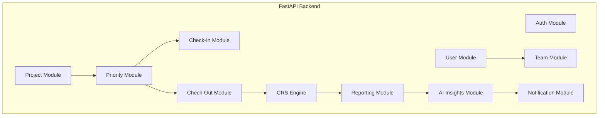

# Componentes Backend (C4 Nivel 3)

## Objetivo

Definir la estructura interna del Backend FastAPI, los módulos funcionales, sus responsabilidades y dependencias.

## Principio General

El Backend se implementará como un **Monolito Modular** siguiendo principios de **Clean Architecture**.

Cada módulo encapsula:

- Casos de uso.
- Reglas de negocio.
- Repositorios.
- DTOs.
- Adaptadores.

## Diagrama General



---

# Auth Module

## Responsabilidades

- Login.
- JWT.
- Roles.
- Permisos.
- Recuperación de contraseña.

## Dependencias

- User Module.

---

# User Module

## Responsabilidades

- Gestión de usuarios.
- Managers.
- Empleados.
- Perfil.

## Entidades

- User
- Role

---

# Team Module

## Responsabilidades

- Equipos.
- Relaciones manager-colaborador.

## Entidades

- Team
- TeamMember

---

# Project Module

## Responsabilidades

- Proyectos.
- Fases.

## Entidades

- Project
- ProjectPhase

---

# Priority Module

## Responsabilidades

- Prioridades.
- Tareas.
- Estados.

## Entidades

- Priority
- Task

Este módulo representa el núcleo del producto.

---

# Check-In Module

## Responsabilidades

- Registro de compromisos.
- Reutilización de prioridades.
- Riesgos iniciales.

## Entidades

- WeeklyCheckIn

---

# Check-Out Module

## Responsabilidades

- Registro de resultados.
- Continuidad de prioridades.
- Bloqueadores.

## Entidades

- WeeklyCheckOut

---

# CRS Engine

## Objetivo

Calcular el Commitment Reliability Score.

## Entradas

- Prioridades comprometidas.
- Prioridades completadas.
- Tareas comprometidas.
- Tareas completadas.
- Arrastres.

## Salidas

- CRS semanal.
- CRS histórico.
- Tendencias.

## Observación

Es el principal diferenciador del producto.

---

# Reporting Module

## Responsabilidades

- Reportes individuales.
- Reportes de equipo.
- Tendencias.
- KPIs.

---

# AI Insights Module

## Responsabilidades

- Resúmenes.
- Detección de riesgos.
- Insights.
- Preparación de reuniones 1:1.

## Dependencia

AI Gateway.

---

# Notification Module

## Responsabilidades

- Recordatorios.
- Alertas.
- Correos futuros.

---

# Dependencias Permitidas

```text
Auth -> Users

Teams -> Users

Projects -> Priorities

Priorities -> CheckIn

Priorities -> CheckOut

CheckOut -> CRS

CRS -> Reports

Reports -> AI Insights

AI Insights -> Notification
```

## Restricciones

- No dependencias circulares.
- No acceso directo entre módulos sin contratos.
- Toda integración externa mediante adaptadores.
