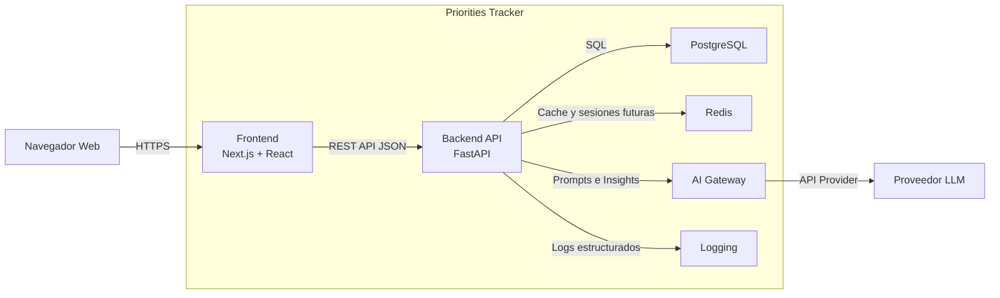

# Contenedores (C4 Nivel 2)

## Objetivo

Describir los principales contenedores que conforman Priorities Tracker y sus interacciones.

## Diagrama de Contenedores

## Contenedores

### Frontend (Next.js)

Responsabilidades:

- Interfaz de usuario.
- Dashboards.
- Check-In.
- Check-Out.
- Reportes.
- Administración.

Tecnología:

- React.
- Next.js.

Justificación:

- Excelente experiencia de desarrollo.
- SSR y optimización.
- Ecosistema maduro.

---

### Backend API (FastAPI)

Responsabilidades:

- Reglas de negocio.
- Gestión de usuarios.
- Gestión de equipos.
- Gestión de prioridades.
- Cálculo CRS.
- Integración IA.

Justificación:

- Alto rendimiento.
- Tipado fuerte.
- Productividad.

---

### PostgreSQL

Responsabilidades:

- Persistencia principal.
- Datos transaccionales.
- Históricos de CRS.

Justificación:

- ACID.
- Modelo relacional robusto.
- Excelente soporte analítico.

---

### Redis

Responsabilidades:

- Cache.
- Rate limiting futuro.
- Colas ligeras futuras.

Justificación:

- Alto rendimiento.
- Baja latencia.

---

### AI Gateway

Responsabilidades:

- Centralizar acceso a IA.
- Desacoplar proveedores.
- Gestionar prompts.
- Controlar costos.

Justificación:

- Evitar dependencia directa con proveedores.
- Facilitar migraciones futuras.

---

### Logging

Responsabilidades:

- Registro estructurado.
- Trazabilidad.
- Diagnóstico.

MVP:

- Logs JSON.

Futuro:

- OpenTelemetry.
- Métricas.
- Tracing distribuido.

## Protocolos de Comunicación

| Origen | Destino | Protocolo |
|----------|----------|-----------|
| Navegador | Frontend | HTTPS |
| Frontend | Backend | REST/HTTPS |
| Backend | PostgreSQL | SQL |
| Backend | Redis | TCP |
| Backend | AI Gateway | HTTP |
| AI Gateway | LLM | HTTPS |

## Consideraciones de Seguridad

### Frontend

- JWT.
- Protección de rutas.

### Backend

- RBAC.
- Validación de entrada.
- Auditoría.

### PostgreSQL

- Acceso privado.
- Backups.

### Redis

- Red interna.
- Sin exposición pública.

### AI Gateway

- Gestión segura de API Keys.
- Control de acceso.

## Evolución Futura

### Observabilidad

Incorporar:

- OpenTelemetry.
- Prometheus.
- Grafana.

### Escalabilidad

Migrar:

Docker Compose → Kubernetes

sin rediseñar la arquitectura.
