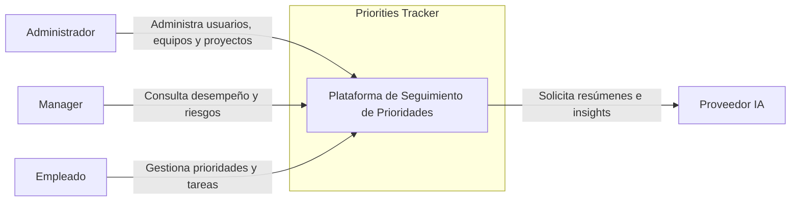

# Contexto del Sistema (C4 Nivel 1)

## Objetivo

Describir cómo Priorities Tracker interactúa con usuarios y sistemas externos.

## Descripción General

Priorities Tracker es una plataforma SaaS enfocada en el seguimiento de prioridades y compromisos semanales. Permite a colaboradores registrar compromisos, a managers dar seguimiento y a administradores gestionar la organización.

## Actores

### Administrador

Responsable de:

- Gestión de usuarios.
- Gestión de equipos.
- Gestión de proyectos.
- Gestión de fases.
- Configuración general.

### Manager

Responsable de:

- Revisar prioridades activas.
- Consultar check-ins.
- Consultar check-outs.
- Analizar CRS.
- Detectar riesgos.
- Realizar seguimiento.

### Empleado

Responsable de:

- Crear prioridades.
- Registrar tareas.
- Realizar check-ins.
- Realizar check-outs.
- Actualizar avances.

## Sistemas Externos

### Proveedor de IA

Servicios utilizados para:

- Resúmenes automáticos.
- Insights.
- Detección de riesgos.
- Preparación de reuniones 1:1.

## Diagrama C4 Style

## Principales Interacciones

1. El empleado registra prioridades semanales.
2. El manager revisa cumplimiento y riesgos.
3. El administrador configura la organización.
4. La plataforma utiliza IA para generar análisis complementarios.

## Consideraciones

- La IA no es un componente crítico para la operación principal.
- El sistema debe continuar funcionando aun si la IA no está disponible.
