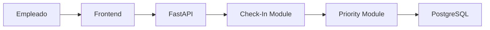
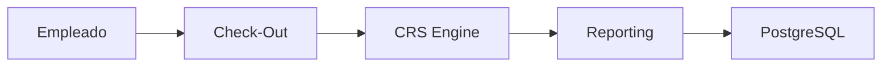
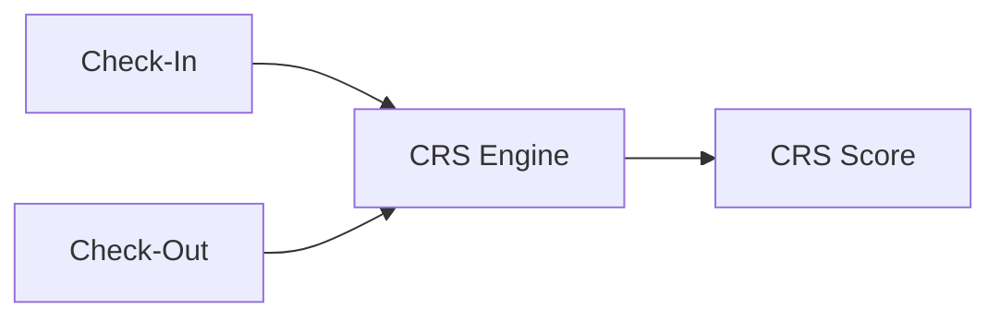
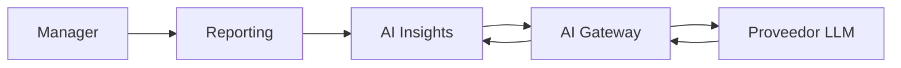

# Flujo de Datos

## Objetivo

Documentar los principales flujos funcionales de Priorities Tracker.

---

# Flujo de Check-In

## Descripción

El empleado registra los compromisos de la semana.

## Resultado

- Prioridades registradas.
- Tareas registradas.
- Riesgos iniciales registrados.

---

# Flujo de Check-Out

## Descripción

El empleado registra resultados obtenidos.

## Resultado

- Cumplimiento calculado.
- Actualización CRS.
- Tendencias actualizadas.

---

# Flujo CRS

## Descripción

Generación del Commitment Reliability Score.

## Factores Considerados

- Prioridades completadas.
- Tareas completadas.
- Arrastres.
- Consistencia histórica.

---

# Flujo IA

## Descripción

Generación de insights para managers.

## Resultado

- Resúmenes automáticos.
- Riesgos.
- Recomendaciones.

---

# Flujo de Notificaciones

## Casos de Uso

- Recordatorio Check-In.
- Recordatorio Check-Out.
- Alertas futuras.

---

# Consideraciones de Observabilidad

Todos los flujos deben registrar:

- Correlation ID.
- Logs estructurados.
- Errores.
- Métricas futuras.

---

# Evolución Futura

Incorporar:

- Event Queue.
- Procesamiento asíncrono.
- OpenTelemetry.
- Métricas de negocio.
