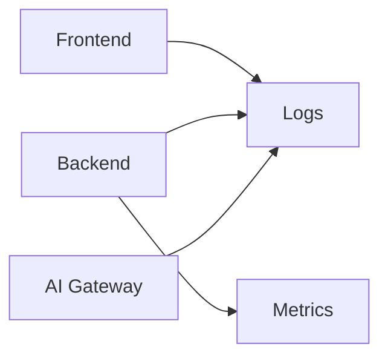

# Arquitectura de Observabilidad

## Objetivo
Proporcionar visibilidad operativa completa del sistema.

## Principios
- Observabilidad desde el diseño.
- Correlación completa.
- Métricas técnicas y de negocio.

## Arquitectura

## MVP
- Logging estructurado JSON.
- Correlation IDs.
- Request IDs.

## Eventos de Negocio
- Login.
- Check-In.
- Check-Out.
- Recalculo CRS.
- Uso IA.

## Métricas Técnicas
- Latencia.
- Throughput.
- Error Rate.

## Evolución
- OpenTelemetry.
- Prometheus.
- Grafana.
- Loki.
