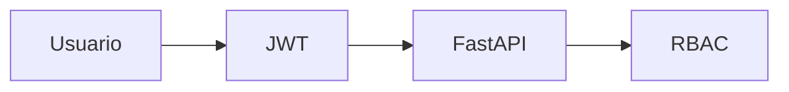

# Arquitectura de Seguridad

## Objetivo
Proteger datos, usuarios y operaciones.

## Principios
- Zero Trust.
- Least Privilege.
- Defense in Depth.

## Autenticación
- JWT Access Token.
- Evolución: Refresh Tokens, MFA, SSO.

## Autorización
Roles:
- Administrador.
- Manager.
- Empleado.

## Diagrama

## Protección API
- JWT Validation.
- Input Validation.
- Rate Limiting.
- RBAC.

## Auditoría
- Login.
- Logout.
- Cambios de rol.
- Check-In.
- Check-Out.
- Recalculo CRS.

## Evolución
- MFA.
- SSO.
- SOC2.
