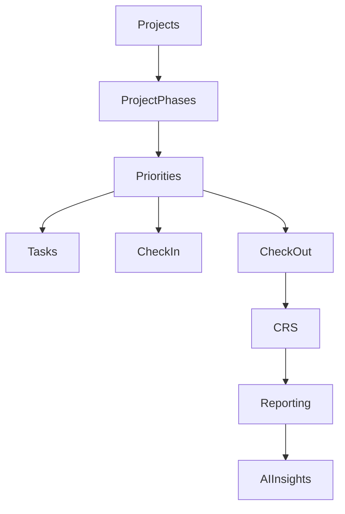

# Backend Overview

## Objetivo

Definir la arquitectura general del backend de Priorities Tracker y establecer las decisiones estructurales que guiarán su implementación.

## Drivers de Negocio

- Seguimiento de prioridades semanales.
- Medición de cumplimiento.
- Commitment Reliability Score (CRS).
- Reportes gerenciales.
- IA como asistente para managers.

## Drivers Técnicos

- Rapidez de desarrollo.
- Simplicidad operativa.
- Escalabilidad progresiva.
- Mantenibilidad a largo plazo.

## Arquitectura Seleccionada

### Modular Monolith

Una única unidad de despliegue con módulos desacoplados por dominio.

Beneficios:

- Menor complejidad.
- Menor costo operativo.
- Desarrollo más rápido.
- Facilidad para equipos pequeños.

### Clean Architecture por Módulo

Cada módulo implementa:

- API Layer
- Application Layer
- Domain Layer
- Infrastructure Layer

### DDD Lite

Uso de:

- Entidades
- Value Objects
- Domain Services
- Repository Interfaces

## Módulos de Negocio

- Auth
- Users
- Teams
- Projects
- Priorities
- CheckIn
- CheckOut
- CRS
- Reporting
- AI Insights

## Jerarquía del Dominio

Proyecto
    ↓
Fase Proyecto
    ↓
Prioridad
    ↓
Tarea

El módulo Projects administra:

- Project
- ProjectPhase

El módulo Priorities administra:

- Priority
- Task

## Diagrama Backend

## Evolución

Docker Compose
    ↓
Kubernetes
    ↓
Extracción Selectiva de Servicios
