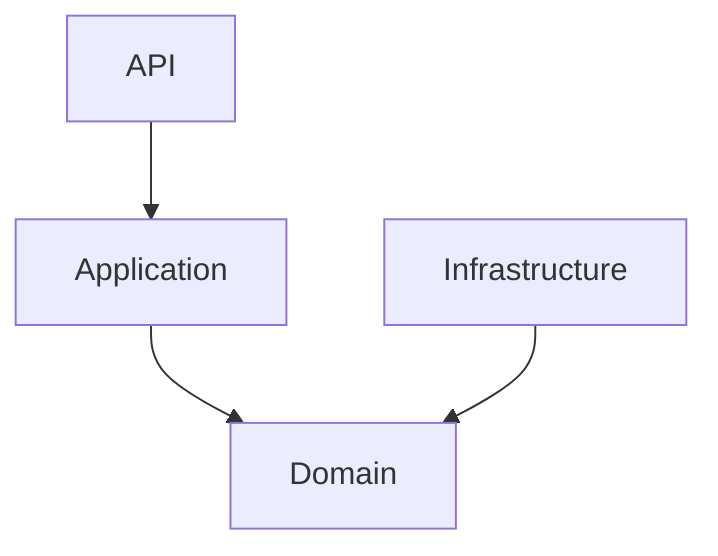

# Clean Architecture

## Objetivo

Definir las reglas estructurales obligatorias para todos los módulos backend.

## Principio Fundamental

La lógica de negocio no depende de frameworks, bases de datos ni proveedores externos.

## Capas

### API Layer

Responsabilidades:

- Endpoints
- Validación
- Serialización

### Application Layer

Responsabilidades:

- Casos de uso
- Orquestación
- Coordinación

Ejemplos:

- CreateCheckInUseCase
- GenerateCRSUseCase

### Domain Layer

Responsabilidades:

- Entidades
- Value Objects
- Reglas de negocio
- Servicios de dominio

Entidades clave futuras:

- Project
- ProjectPhase
- Priority
- Task

### Infrastructure Layer

Responsabilidades:

- PostgreSQL
- Redis
- AI Gateway
- Repositorios

## Regla de Dependencias

## Dependencias Prohibidas

- Domain -> FastAPI
- Domain -> SQLAlchemy
- Domain -> Redis
- Domain -> Infrastructure

## Flujo de Caso de Uso

Seleccionar Proyecto
    ↓
Seleccionar Fase
    ↓
Crear Prioridad
    ↓
Agregar Tareas
    ↓
Registrar Check-In

## Integración con Persistencia

Use Case
    ↓
Repository Interface
    ↓
Repository Implementation
    ↓
PostgreSQL

## Integración con IA

Use Case
    ↓
AI Gateway Interface
    ↓
AI Adapter
    ↓
Provider

## Criterios de Cumplimiento

Todo módulo debe contener:

- api/
- application/
- domain/
- infrastructure/

No se permiten dependencias circulares.
