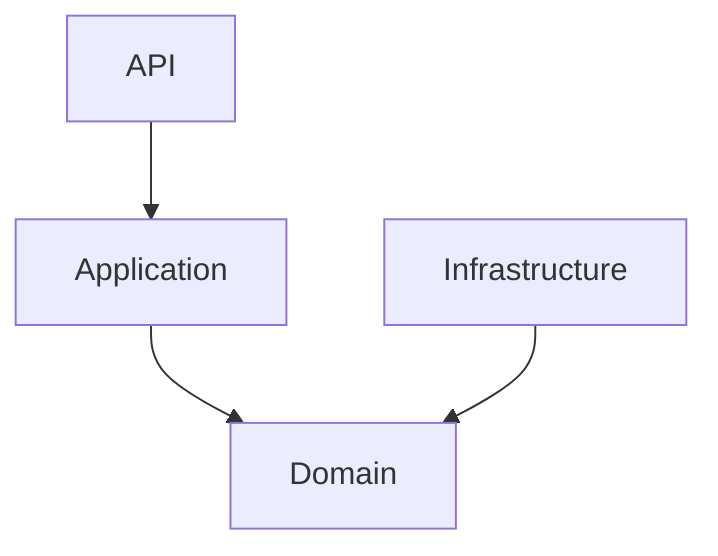

# Dependency Rules

## Objetivo

Definir las dependencias permitidas y prohibidas dentro del backend.

---

# Regla Fundamental

Las dependencias siempre apuntan hacia el dominio.


---

# Dependencias Permitidas

## API Layer

Puede depender de:

- Application
- Shared

## Application Layer

Puede depender de:

- Domain
- Shared

## Infrastructure Layer

Puede depender de:

- Domain
- Shared

## Domain Layer

No debe depender de:

- FastAPI
- SQLAlchemy
- Redis
- OpenAI
- Infraestructura

---

# Dependencias Entre Módulos

## Permitidas

```text
Projects -> Priorities

Priorities -> CheckIn

Priorities -> CheckOut

CheckOut -> CRS

CRS -> Reporting

Reporting -> AI Insights
```

---

# Dependencias Prohibidas

```text
AI Insights -> CheckOut

CRS -> Projects

Domain -> Infrastructure

Domain -> FastAPI

Domain -> SQLAlchemy
```

---

# Comunicación Entre Módulos

Preferir:

- Interfaces
- DTOs
- Application Services

Evitar:

- Acceso directo a repositorios de otro módulo.
- Uso de entidades internas de otro módulo.

---

# Shared Layer Rules

Los componentes de shared son reutilizables.

Permitidos:

- Configuración
- Seguridad
- Logging
- Base de datos
- AI Gateway

No permitido:

- Reglas de negocio.

---

# Dependency Validation

Toda Pull Request debe validar:

- Ausencia de dependencias circulares.
- Respeto a capas.
- Respeto a ownership del dominio.

---

# Ejemplo Correcto

CreateCheckInUseCase
    ↓
PriorityRepository Interface
    ↓
PriorityRepositorySQLAlchemy

---

# Ejemplo Incorrecto

CreateCheckInUseCase
    ↓
SQLAlchemy Session
    ↓
Database

El caso de uso nunca debe conocer la implementación técnica.
